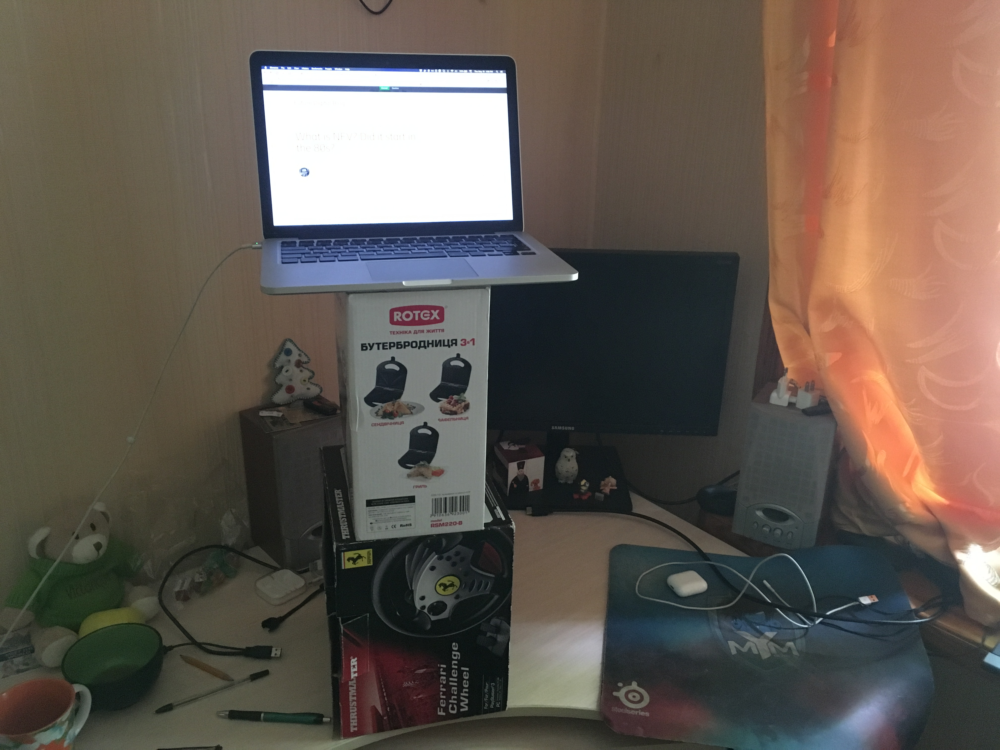

## Личный опыт и мотивация

Я сижу за компьютером целыми днями с тех пор, как мне его купили: сначала игрушки, затем учеба, теперь работа.

Сидеть весь день — моя самая вредная привычка и главный источник вреда моему здоровью. Помимо запорожского воздуха, конечно.

Год назад я осознал, что здоровье не вечно и задумался как его сохранить. Так как проблем у меня немного, решил придумать, как поменьше сидеть.

К счастью, решения есть и даже несколько.

## В чем проблема

В 20-ом веке люди больше всего страдали от курения, а теперь — от сидения.

По статистике, которую я нагуглил за 5 минут:
- 86% людей сидят большую часть дня;
- около 50% людей зарабатывают на жизнь сидя за компьютером.

За последние 50 лет ученые и медики провели тысячу и одно исследование, которые сводятся к одному: **много сидеть — вредно**.

Причины:
- сердце не получает достаточной нагрузки;
- спина — слишком много нагрузки;
- плохое кровообращение в ногах;
- таз становится зажатым.

Результат: сердце болеет, спину ломит, а пузо напоминает пакет с желе.

Обычно проблемы не проявляются в полной мере до 30-35 лет, поэтому забивать на них легко.

## Спорт не поможет

Очевидным решением напрашивается спорт. Мол, ходи в зал 3 раза в неделю и двигайся сколько влезет.

Заниматься спортом однозначно **намного** лучше, чем не заниматься, но проблему спорт не решает.

На зал будет уходить 2-3 часа в день с учетом дороги, а сидим мы обычно часов по 10 или больше. Вместо 70 часов в неделю, мы теперь сидим 60-64 и занимаемся спортом. Лучше, но далеко от полноценного решения.

Зал можно заменить прогулками, ведь главная цель – не сидеть, а прогулки не требуют ничего, кроме времени.

## Работаем стоя

Единственное эффективное решение проблемы целиком — работать за компьютером стоя большую часть времени.

Уточню, что решения в первую очередь касаются ноутбуков. О настольных ПК напишу в конце.

Дальше есть три варианта:
1. standing desk (стол за которым стоишь);
2. картонные коробки;
3. подставка.

### 1. Standing desk

По сути — просто высокий стол, за которым можно только стоять.

Бывают двух видов: регулируемые и нет. Регулируемые можно опустить и сесть на стул, но это создает искушение сидеть чаще, чем стоять. С нерегулируемыми не сядешь даже если захочешь.

Главный плюс – все лежит на одном уровне с ноутбуком: никуда не тянешься.

Лично я стол не купил по трем причинам:
- качественные модели начинаются от 200$;
- в Украине плохой выбор;
- нужно избавиться от старого стола и переместить кучу вещей.

### 2. Картонные коробки

Бюджетный вариант. Использовал три месяца перед покупкой подставки.

Достаем с балкона коробки из-под бытовой техники, составляем подходящую высоту и плюхаем на стол.

Плюсы:
- условно бесплатно.

Минусы:
- занимают кучу пространства на столе;
- нужно убирать их чтоб посидеть, а затем ставить обратно – быстро задалбывает;
- за остальными вещами на столе приходится наклоняться.

### 3. Подставка

Мой текущий вариант.

Улучшенная версия коробок с двумя отличиями:
- удобнее убирать и ставить; я не убираю вообще, а переставляю ноутбук вниз;
- не отнимает свободное место у стола: ставлю воду или тарелку с едой под подставку.

Я купил [UFT FreeTable-1 Light](https://rozetka.com.ua/notebooktable_free_table_1_light/p28229217/), но есть куча других вариантов.

ВАЖНО: перед покупкой советую проверить максимальную высоту подставки и прикинуть сколько это будет поверх стола. Подставка может оказаться слишком низкой и практически бесполезной, по крайней мере, без костылей.

## Что делать с ПК

Лучший вариант: standing desk + крепеж для монитора.

Сам не решал такую проблему, могут быть и другие варианты, но в голову не приходят.

Тоже самое касается конфигурации "ноутбук + монитор".

## Сколько стоять

Однозначного мнения нет: одни говорят "больше – лучше", другие – 50 на 50.

Лично я исходил из своих возможностей и здравого смысла.

Обычно стою большую часть дня, но все еще сижу 2-4 часа.

## Если болят ноги

У каждого организм реагирует по-своему. Мне было сложно стоять больше часа первые пару недель — болели пятки.

Не думаю, что поможет каждому, но я нашел причину своей проблемы. Дело было в твердом деревянном полу.

Решение: подстелить что-то мягкое типа коврика. Лично я подстелил свернутый в 4 раза каремат.

## Узнать больше

- хороший ресурс на английском: https://notsitting.com
- [Лайхакер – 5 причин работать стоя](https://lifehacker.ru/5-prichin-rabotat-stoya/)
- [Хабр – Как и зачем я стал работать за компьютером стоя](https://habr.com/post/112169/)

